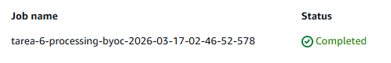
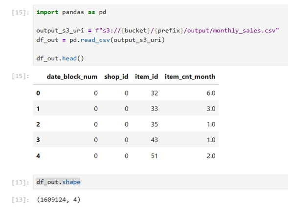

# Tarea 06: SageMaker Processing Job — BYOC con scikit-learn
## Diana Arroyo / Luis Cuadros

## Descripción del proyecto
En esta tarea se implementó un SageMaker Processing Job usando el patrón Bring Your Own Container (BYOC) para ejecutar una lógica de preprocesamiento de datos con `scikit-learn`, `pandas` y `numpy`.

El objetivo fue construir un flujo reproducible y desacoplado del entorno local, donde SageMaker administra la transferencia de archivos entre Amazon S3 y el contenedor, mientras que el script de procesamiento trabaja únicamente con rutas locales dentro de `/opt/ml/processing/`.

El procesamiento realizado transforma el archivo crudo `sales_train.csv` en un dataset agregado a nivel mensual, generando como salida el archivo `monthly_sales.csv`, el cual posteriormente queda almacenado en S3.

---

## Estructura del repositorio
```text
Tarea_6/
├── data/
│   └── raw/
│       └── sales_train.csv
├── processing/
│   ├── container/
│   │   └── Dockerfile
│   └── prep.py
├── sm_processing_byoc.ipynb
├── README.md
└── requirements.txt
├── images/
│   ├── processing_job_completed.png
│   ├── ecr_repository.png
│   ├── s3_output.png
│   └── notebook_output.png
```
---

## Flujo de procesamiento
En este flujo, SageMaker administra automáticamente la entrada y salida mediante ProcessingInput y ProcessingOutput, por lo que el script no necesita leer ni escribir directamente en S3.

## Script de preprocesamiento: processing/prep.py

Este archivo contiene la lógica de transformación del dataset.

Su función es:

- leer el archivo sales_train.csv desde /opt/ml/processing/input/
- transformar los datos a nivel mensual
- generar el archivo monthly_sales.csv en /opt/ml/processing/output/

El script fue diseñado para ejecutarse dentro del contenedor del Processing Job y trabajar con rutas locales administradas por SageMaker.


## Contenedor BYOC: processing/container/Dockerfile

Se construyó una imagen Docker mínima basada en python:3.11-slim, con las dependencias necesarias para ejecutar el script de procesamiento.

Dependencias instaladas en la imagen:

- pandas
- numpy
- scikit-learn

El contenedor se mantuvo simple y enfocado únicamente en procesamiento, sin incluir componentes de training o serving.

## Notebook de ejecución: sm_processing_byoc.ipynb

Este notebook implementa el flujo completo de ejecución en SageMaker:

1. Inicialización de la sesión de SageMaker
2. Obtención de región, rol y bucket por defecto
3. Definición de rutas locales del proyecto
4. Carga del dataset crudo a S3
5. Construcción de la imagen Docker
6. Publicación de la imagen en Amazon ECR
7. Creación del ScriptProcessor
8. Ejecución del Processing Job
9. Validación del output generado en S3
10. Inspección del archivo transformado con pandas

## Construcción y publicación de la imagen

La imagen del contenedor fue construida localmente en SageMaker Studio y posteriormente publicada en Amazon ECR.

- Repositorio en ECR: tarea-6-processing-byoc
- Tag utilizado: latest

## Ejecución del Processing Job

El job se ejecutó con ScriptProcessor utilizando:

- imagen publicada en Amazon ECR
- rol de ejecución de SageMaker
- instancia ml.m5.large
- input desde S3
- output hacia S3

La ejecución concluyó exitosamente con estatus **Completed**.

## Resultado obtenido

El archivo de salida generado fue:
s3://sagemaker-us-east-1-995371347105/tarea-6-processing-byoc/output/monthly_sales.csv

La validación en notebook confirmó que el archivo fue generado correctamente y que su estructura final es la esperada.

Columnas del output
- date_block_num
- shop_id
- item_id
- item_cnt_month

Dimensión del dataset resultante
(1609124, 4)

## Evidencias de ejecución

### 1. Processing Job completado en SageMaker



### 2. Repositorio e imagen publicados en Amazon ECR


### 3. Archivo de salida almacenado en Amazon S3


### 4. Validación del output en notebook




## Tecnologías y dependencias utilizadas

- Python 3.11
- Amazon SageMaker
- Amazon S3
- Amazon ECR
- boto3
- sagemaker
- pandas
- numpy
- scikit-learn

## Conclusión

Con esta implementación se construyó exitosamente un pipeline de preprocesamiento reproducible usando Amazon SageMaker Processing con un contenedor propio. El enfoque BYOC permitió controlar las dependencias del entorno, desacoplar la lógica de transformación del ambiente local y generar un flujo escalable listo para integrarse con etapas posteriores del pipeline de machine learning.
